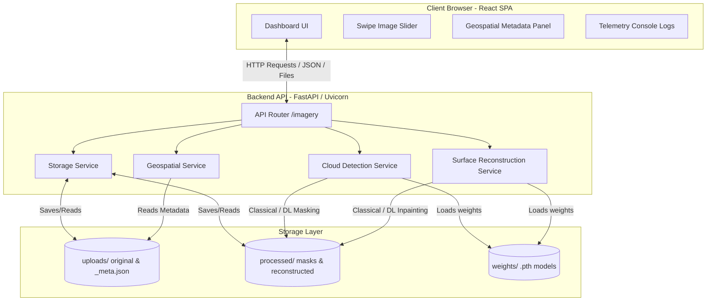
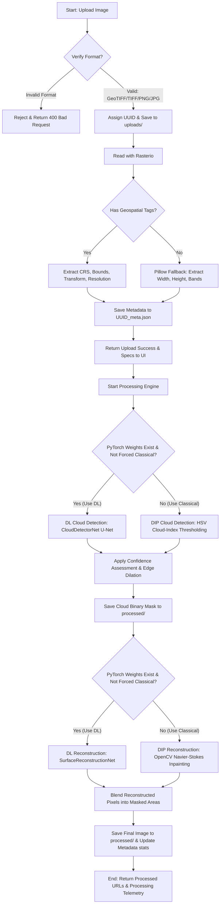

# TerraClear: LISS-IV Cloud Removal & Surface Reconstruction

TerraClear is a web-based, dual-engine image processing platform designed for satellite imagery analysis. It is specifically optimized to ingest, analyze, and reconstruct **ISRO's LISS-IV (Linear Imaging Self-Scanning Sensor-IV)** multispectral satellite scenes, but seamlessly handles standard TIFF, GeoTIFF, PNG, and JPEG imagery via an intelligent fallback mechanism.

The platform provides automatic cloud detection and high-fidelity surface reconstruction (inpainting) using either state-of-the-art Deep Learning models (PyTorch) or classical Digital Image Processing (DIP) algorithms.

---

## 🏗️ System Architecture

TerraClear is built on a modern decoupled architecture:

1. **Frontend**: A high-performance SPA built with **React**, **Vite**, and **Lucide Icons**, styled with custom Glassmorphism CSS for a premium dark-mode dashboard.
2. **Backend**: A robust API service powered by **FastAPI** and **Uvicorn**, handling upload parsing, metadata analysis, and job execution.
3. **Geospatial Engine**: Leverages **Rasterio** and **GeoPandas** to extract georeferencing information (CRS, bounds, resolution, and affine matrices).
4. **AI/DIP Processing Engine**: Runs deep neural networks in **PyTorch** or falls back to optimized mathematical routines in **OpenCV** & **NumPy**.

### Architecture Diagram



---

## 📈 Technical Workflow & Pipelines

TerraClear implements a structured image ingestion and refinement pipeline:



### 1. Ingestion & Geospatial Parsing Pipeline
- Enforces strict format validations (accepts `.tif`, `.tiff`, `.png`, `.jpg`, `.jpeg`).
- Reads geospatial headers using `Rasterio` to support ISRO-standard geo-tags. If present, it maps bounding box coordinates, Coordinate Reference Systems (CRS) in WKT/EPSG form, affine transformation coefficients, and spatial resolutions.
- Falls back to `Pillow` for standard imagery, ensuring cross-compatibility.

### 2. Cloud Detection Pipeline
- **Deep Learning (U-Net)**: Uses `CloudDetectorNet` (a custom U-Net with contracting and expansive paths) to predict a continuous probability map of clouds. The output is thresholded and cleaned up with morphological closing/dilation to capture thin cloud halos.
- **Classical DIP (HSV Thresholding)**: Transforms the BGR image to the HSV (Hue, Saturation, Value) color space. It computes a custom **Cloud Index**:
  $$\text{Cloud Index} = \text{Value} \times (1.0 - \text{Saturation})$$
  High values indicate bright, low-saturation features (clouds). Adaptive thresholding and morphological operations eliminate minor agricultural/topographical noise.

### 3. Surface Reconstruction (Inpainting) Pipeline
- **Deep Learning (Encoder-Decoder)**: Uses `SurfaceReconstructionNet` (a 4-level convolutional encoder-decoder). The network receives a 4-channel input (RGB + 1-channel binary cloud mask). It projects the features into a low-dimensional space and reconstructs them through transpose convolutions. Finally, it uses a **hard-blend function** to replace pixels *only* within the cloud mask boundaries:
  $$\text{Blended} = \text{Original} \times (1.0 - \text{Mask}) + \text{Model Output} \times \text{Mask}$$
- **Classical DIP (Navier-Stokes/Telea)**: Uses OpenCV's fast marching method (Telea) for image inpainting. The confidence score is modeled dynamically as a function of cloud coverage percentage:
  $$\text{Confidence} = e^{-0.03 \times \text{Cloud Coverage \%}}$$

---

## 🛠️ Technology Stack & Libraries

### Languages Used
- **Python**: Powering the FastAPI backend, geospatial conversions, and PyTorch deep learning models.
- **JavaScript (ES6+)**: Powers the React frontend and client-side rendering.
- **HTML5 & CSS3**: Custom layouts using CSS Variables for premium Glassmorphic styles.

### Core Backend Dependencies
The backend uses Python 3.10+ and the following libraries (defined in `backend/requirements.txt`):
* **`FastAPI`** (0.110.0+): High-performance async web framework.
* **`Uvicorn`** (0.28.0+): ASGI server implementation for run loop.
* **`Pydantic`** (2.6.0+): Data validation and settings management.
* **`PyTorch`** (2.0.0+): Deep Learning framework for execution of U-Net and Autoencoder.
* **`Rasterio`** (1.3.0+): Fast I/O library for geospatial rasters (GeoTIFF).
* **`OpenCV-Python`** (4.9.0+): Computer vision library for classical DIP fallbacks and post-processing.
* **`NumPy`** (1.24.0+): Scientific computing and matrix manipulation.
* **`GeoPandas`** (0.14.0+): Geospatial vector data manipulation tools.
* **`Pillow`** (10.2.0+): Core image reading operations.
* **`Pytest`** (8.0.0+) & **`HTTPX`** (0.27.0+): Automated testing framework.

### Core Frontend Dependencies
The frontend uses Node.js and the following NPM modules (defined in `frontend/package.json`):
* **`React`** (19.2.7+): Client-side component system.
* **`Vite`** (8.1.1+): Dev server and production builder.
* **`Lucide-React`** (1.22.0+): Clean modern SVG vector icons.
* **`Oxlint`** (1.71.0+): Ultra-fast linter.

---

## 📦 Installation & Setup

### Prerequisites
- **Python** (version 3.10 or 3.11 recommended)
- **Node.js** (version 18 or above recommended)
- **Git**

### Step 1: Clone the Repository
```bash
git clone https://github.com/your-username/TerraClear.git
cd TerraClear
```

### Step 2: Setup the Backend
1. Navigate to the backend directory:
   ```bash
   cd backend
   ```
2. Create and activate a virtual environment:
   * **Windows (PowerShell)**:
     ```powershell
     python -m venv venv
     .\venv\Scripts\Activate.ps1
     ```
   * **Linux/macOS**:
     ```bash
     python3 -m venv venv
     source venv/bin/activate
     ```
3. Install the dependencies:
   ```bash
   pip install -r requirements.txt
   ```
4. Place weight models (optional):
   If you have pre-trained model weights, create a `weights` directory inside the `backend` folder and place `cloud_detector.pth` and `reconstruction_net.pth` inside it. If missing, the backend will automatically fallback to the classical DIP pipelines.

### Step 3: Setup the Frontend
1. Open a new terminal and navigate to the frontend directory:
   ```bash
   cd frontend
   ```
2. Install Node packages:
   ```bash
   npm install
   ```

---

## 🚀 Running the Application

### 1. Running the Backend Server
From the `backend` directory, run:
```bash
python run.py
```
* The API server starts on **`http://localhost:8000`** with dynamic reloading enabled.
* You can access interactive API documentation (Swagger UI) at **`http://localhost:8000/docs`**.

### 2. Running the Frontend App
From the `frontend` directory, run:
```bash
npm run dev
```
* The development server starts on **`http://localhost:5173`**.
* Open your browser and navigate to the printed address to view the TerraClear Dashboard.

### 3. Generating Sample Datasets (Testing Ingestion)
To generate synthetic LISS-IV imagery mimicking multi-spectral scenes with terrain, rivers, puffy clouds, and soft shadows, execute the sample generator script from the root or backend directory:
```bash
cd backend
python tests/generate_sample.py
```
This generates:
* `c:/TerraClear/data/sample_liss4.png` (satellite terrain with clouds and shadows)
* `c:/TerraClear/data/sample_liss4_ground_truth.png` (clear ground-truth terrain)

These files are perfect for testing the drag-and-drop feature in the UI.

### 4. Running the Test Suite
TerraClear includes a comprehensive integration test suite. Ensure the virtual environment is active, then run:
```bash
cd backend
pytest tests/test_platform.py
```
The test suite validates:
- Image storage and UUID matching.
- Geospatial metadata extractor with Pillow fallbacks.
- Cloud detection thresholds and binary mask creation.
- Surface reconstruction and inpainting confidence calculations.
- FastAPI routes (`/health` check and invalid format upload handling).

---

## 📂 Project Structure

```
TerraClear/
├── backend/
│   ├── app/
│   │   ├── api/
│   │   │   └── endpoints/
│   │   │       └── imagery.py         # Ingestion, processing and download endpoints
│   │   ├── core/
│   │   │   ├── config.py             # Global Pydantic configuration & paths
│   │   │   └── logging.py            # Logger setup
│   │   ├── models/
│   │   │   └── networks.py           # U-Net & Inpainting neural networks
│   │   ├── schemas/
│   │   │   └── imagery.py            # Pydantic validation schemas
│   │   ├── services/
│   │   │   ├── detection.py          # Classical/DL cloud mask detection
│   │   │   ├── geospatial.py         # Rasterio/Pillow geospatial tag parser
│   │   │   ├── reconstruction.py     # Classical/DL surface inpainting
│   │   │   └── storage.py            # File system manager
│   │   └── main.py                   # FastAPI initialization
│   ├── tests/
│   │   ├── generate_sample.py        # Synthetic satellite dataset generator
│   │   └── test_platform.py          # Unit & integration tests
│   ├── weights/                      # Weights dir (contains cloud_detector.pth, etc.)
│   ├── requirements.txt              # Backend library dependencies
│   └── run.py                        # Backend application bootstrapper
├── data/                             # Created dynamically at runtime
│   ├── uploads/                      # Uploaded files & metadata JSONs
│   └── processed/                    # Output masks & reconstructed imagery
├── datasets/                         # Dataset root directory
│   └── RICE_DATASET/                 # Default RICE satellite cloud removal dataset
└── frontend/
    ├── src/
    │   ├── assets/                   # Static media assets
    │   ├── components/
    │   │   ├── Dashboard.jsx         # Main glassmorphism dashboard UI
    │   │   ├── ImageSlider.jsx       # Swipe before/after comparison slider
    │   │   └── MetadataPanel.jsx     # Technical specs & geospatial coordinate table
    │   ├── utils/
    │   │   └── api.js                # Frontend-backend API requests layer
    │   ├── App.css
    │   ├── App.jsx
    │   ├── index.css                 # Core CSS design variables & glassmorphism system
    │   └── main.jsx
    ├── index.html
    ├── package.json                  # Frontend library dependencies
    └── vite.config.js                # Vite build compiler configurations
```
